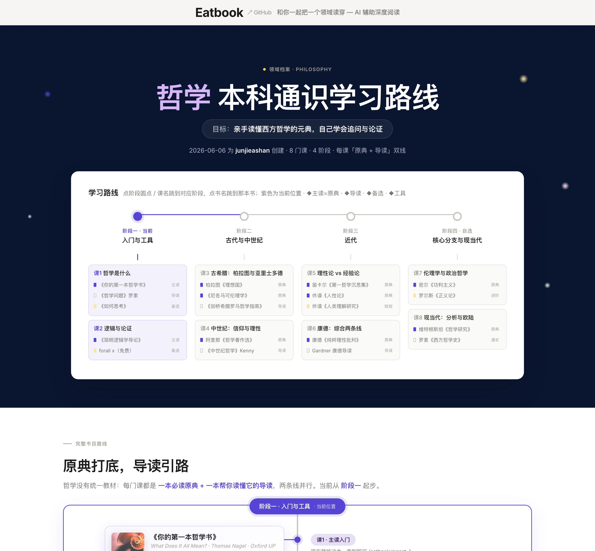

<div align="center">

# 🎓 大学 · University

**给 AI 一个学科，换回一张「学到通」的路线图。**

  

输入一个领域，它检索全球顶尖大学的培养方案与专业学会课程体系，产出一份**分阶段、可交互**的学习路线档案——每个阶段学什么、配哪本书、现在去找哪一本，一屏看清。

</div>

---

## ⚡ 30 秒开始

```bash
npx skills add junjieashan/university-skill
```

装好后，对你的 AI agent 说一句：

```
/university 我想系统学习哲学
```

它就会去检索、选书，给你生成下面这样一份档案 👇

---

## 🖼 长什么样

**第一屏 · 横向节点路线图**——4 个阶段串成一条线，每门课列出全部书，点阶段 / 点书名直接跳转：



**竖向书目时间轴**——每门课主选书 + 备选书分列中轴两侧（原典 + 导读双线），封面 / 作者 / 出版社 / 哪些大学在用都在；阶段用框线圈起，滚动时中轴随进度填充：


> 🔗 **在线体验**（可滚动、点击跳转、阶段高亮）：<https://junjieashan.github.io/university-skill/examples/philosophy.html>

---

## ✨ 它解决什么

自学一个陌生领域，最大的摩擦从来不是找不到资料，而是：

- **不知道按什么顺序学** —— 一上来啃了太难的，挫败放弃；
- **不知道读哪本书** —— 同一门课十几本教材，哪本不预设基础、适合我？
- **学着学着没了方向感** —— 不知道学到哪了、下一步是什么。

`university` 把这三件事一次解决：一张**可溯源**的「该学什么 → 读哪本 → 什么顺序 → 现在去找什么」地图，每一处声称都链到真实的大学课程页。

## ✅ 适合 / ❌ 不适合

| ✅ 适合 | ❌ 不适合 |
|---|---|
| 系统自学一个学科（数学 / CS / 哲学 / 神经科学…） | 查一个具体知识点（直接问 AI 更快） |
| 想要"先读哪本、再读哪本"的清晰顺序 | 已经是该领域专家、只缺前沿文献 |
| 零基础，需要不预设门槛的入门教材 | 速成 / 应试突击 |

## 📦 安装

skill 的本体是一份 `SKILL.md`，符合开放标准——**一个命令装到几乎所有 agent**。

### ① npx skills（推荐，支持 70+ agent）

```bash
# 交互式：自动检测你装了哪些 agent
npx skills add junjieashan/university-skill

# 或指定 agent / 全局安装
npx skills add junjieashan/university-skill --agent claude-code cursor
npx skills add junjieashan/university-skill -g
```

由 [vercel-labs/skills](https://github.com/vercel-labs/skills) 驱动，支持 Claude Code、Codex、Cursor、OpenCode 等 70+ agent。

### ② Claude Code 插件市场

```
/plugin marketplace add junjieashan/university-skill
/plugin install university@university
/reload-plugins
```

### ③ 脚本 / 手动

```bash
# 一键脚本（自动检测 Claude Code / Codex）
curl -fsSL https://raw.githubusercontent.com/junjieashan/university-skill/main/install.sh | bash

# 或手动复制
git clone https://github.com/junjieashan/university-skill
cp -r university-skill/skills/university ~/.claude/skills/   # 或 ~/.agents/skills/
```

其他认 `AGENTS.md` 的工具（Aider / Windsurf / Gemini CLI…）会自动读到仓库根的 `AGENTS.md`。

## 🔄 更新

skill 在持续迭代（最近一次：**封面改为生成时内联 base64**，解决国内 / 离线打不开书影的问题）。
更新 = **按你当初的装法重跑一遍安装命令**，会用本仓库最新版覆盖旧文件：

```bash
# ① npx 装的：重跑即从本仓库拉取最新版（如提示是否覆盖，选是）
npx skills add junjieashan/university-skill

# ③ 脚本装的：重跑一键脚本
curl -fsSL https://raw.githubusercontent.com/junjieashan/university-skill/main/install.sh | bash
```

② Claude Code 插件：在 `/plugin` 管理界面里更新该插件。
覆盖后即生效；已生成的旧档案不受影响，想要新封面重新生成一次即可。

## 💡 用法

```
/university 我想系统学习哲学
```

给一句话目标即可。口径模糊时它会简要追问（通识打底，还是攻某个流派），然后检索、选书、生成档案。产出落在 `domains/<领域>/00-domain.html`。

## 📂 目录结构

```
university-skill/
├── skills/university/
│   ├── SKILL.md            # skill 核心：流程与产出规范
│   └── references/         # 检索协议、来源分级、产出模板、封面内联脚本
├── examples/philosophy.html # 哲学范例（在线预览同款）
├── install.sh              # 跨平台安装脚本
├── AGENTS.md               # 跨工具兼容入口
└── .claude-plugin/         # Claude Code 插件 / marketplace 配置
```

## 🧩 它属于 Eatbook

`university` 是 [Eatbook](https://github.com/junjieashan)「最小摩擦的彻底理解」阅读系统的第一步——选好书、排好路线之后，还有入库、深读、共读、分支深研。

---

<div align="center">
<sub>MIT License · by <a href="https://github.com/junjieashan">junjieashan</a></sub>
</div>
